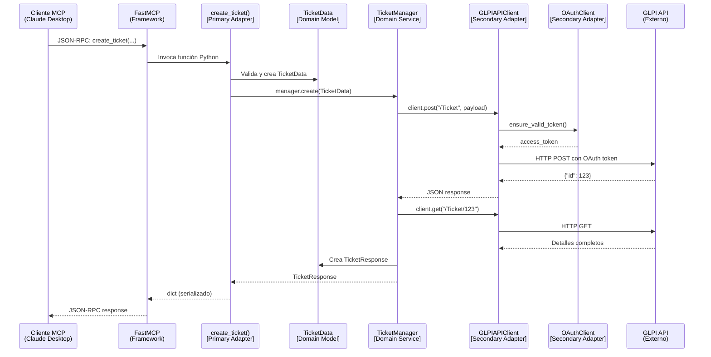

# Arquitectura GLPI MCP

Este documento describe la arquitectura y estructura del servidor MCP para GLPI, diseñado siguiendo los principios de la Arquitectura Hexagonal (Puertos y Adaptadores) y SOLID.

## Resumen del Proyecto

El servidor GLPI MCP es una aplicación que actúa como puente entre un modelo de Inteligencia Artificial (a través del protocolo MCP) y una instancia de GLPI. Permite la gestión automatizada de contratos, tickets y facturas, así como el procesamiento inteligente de documentos para extraer información relevante.

## Estructura de Directorios

El proyecto sigue una estructura modular clara:

```text
server/src/glpi_mcp_server/
├── auth/                 # [Infrastructure] Autenticación OAuth 2.1
├── config/               # [Configuration] Ajustes y variables de entorno
├── glpi/                 # [Adapter] Cliente y modelos de la API de GLPI
│   ├── models.py         # [Domain] Entidades y Modelos de Datos (Pydantic)
│   └── api_client.py     # [Driven Adapter] Comunicación con GLPI
├── processors/           # [Domain Service / Ports] Procesamiento de documentos
│   ├── base_processor.py # [Port] Contrato (interfaz) para procesadores
│   └── *_processor.py    # [Adapter Implementations] Implementaciones específicas
├── tools/                # [Driving Adapter] Herramientas expuestas al MCP
├── resources/            # [Driving Adapter] Recursos expuestos al MCP
└── server.py             # [Composition Root] Punto de entrada y configuración
```

## Mapeo con Arquitectura Hexagonal

La arquitectura se divide en tres capas concéntricas:

### 1. Dominio (Núcleo)
Es el corazón de la aplicación, independiente de frameworks o tecnologías externas.
*   **Archivos**: `glpi/models.py`, `processors/base_processor.py` (definición de la interfaz).
*   **Responsabilidad**: Define las entidades (`ContractData`, `TicketData`) y las reglas de negocio (interfaces de procesamiento). No sabe nada de HTTP, MCP o OAuth.

### 2. Puertos (Interfaces)
Definen cómo el mundo exterior interactúa con el dominio (Driving) o cómo el dominio interactúa con servicios externos (Driven).
*   **Puertos de Entrada (Driving)**: Definidos implícitamente por las herramientas disponibles en `tools/*.py`.
*   **Puertos de Salida (Driven)**:
    *   `BaseProcessor` (en `processors/base_processor.py`): Define el contrato que cualquier procesador de documentos debe cumplir.
    *   Interfaces implícitas usadas por `DocumentTools` para comunicarse con `BaseProcessor`.

### 3. Adaptadores (Infraestructura)
Implementan los puertos para tecnologías específicas.
*   **Adaptadores Primarios (Driving Adapters)**:
    *   `tools/*.py`: Funciones que convierten las solicitudes del protocolo MCP (JSON-RPC) en llamadas a la lógica de negocio. Son el verdadero punto de entrada a la aplicación.
*   **Adaptadores Secundarios (Driven Adapters)**:
    *   `glpi/api_client.py`: Implementa la comunicación HTTP con la API REST de GLPI.
    *   `auth/oauth_client.py`: Maneja la autenticación segura OAuth 2.1.
    *   `processors/contract_processor.py`: Implementación concreta que usa un LLM específico para procesar contratos.
*   **Composition Root**:
    *   `server.py`: No es un adaptador, sino el punto donde se ensambla toda la aplicación. Registra las herramientas en FastMCP y configura las dependencias.

## Flujo de Ejecución: Ejemplo "Crear Ticket"

Para entender cómo las capas trabajan juntas, veamos qué ocurre cuando un usuario solicita crear un ticket:



### Paso a paso:

1. **Cliente MCP → FastMCP Framework**: El usuario envía una solicitud JSON-RPC.
2. **FastMCP → `create_ticket()` (Primary Adapter)**: El framework invoca la función registrada en `tools/ticket_tools.py`.
3. **Tool → Domain**: La función valida los parámetros y crea un objeto `TicketData` (modelo de dominio).
4. **Tool → TicketManager**: Delega la lógica de creación al servicio de dominio.
5. **TicketManager → GLPIAPIClient (Secondary Adapter)**: Convierte el modelo a JSON y solicita la creación vía HTTP.
6. **GLPIAPIClient → OAuthClient**: Verifica/obtiene un token de autenticación válido.
7. **GLPIAPIClient → GLPI API**: Realiza la petición HTTP real al servidor externo.
8. **Retorno**: La respuesta viaja de vuelta por las mismas capas, transformándose de JSON crudo a objetos de dominio (`TicketResponse`) y finalmente a JSON para el cliente.

## Principios SOLID Aplicados

### SRP: Single Responsibility Principle (Responsabilidad Única)
Cada módulo tiene una responsabilidad clara:
*   `auth`: Solo maneja tokens y OAuth.
*   `glpi`: Solo se encarga de hablar con la API de GLPI.
*   `processors`: Solo se encarga de extraer texto y datos de documentos.
*   `tools`: Solo define la interfaz para el cliente MCP, delegando la lógica.

### OCP: Open/Closed Principle (Abierto/Cerrado)
El sistema está abierto a la extensión pero cerrado a la modificación.
*   **Ejemplo**: Si quieres añadir soporte para procesar **Tickets** desde un PDF, solo tienes que:
    1. Crear una nueva clase `TicketProcessor` que herede de `BaseProcessor`.
    2. Añadir una función `process_ticket()` en `tools/document_tools.py` que use el nuevo procesador.
    
    No necesitas modificar el código existente en `BaseProcessor` ni en los procesadores ya implementados (`ContractProcessor`, `InvoiceProcessor`).

### LSP: Liskov Substitution Principle (Sustitución de Liskov)
Las subclases deben ser sustituibles por sus clases base.
*   Cualquier procesador (`ContractProcessor`, `InvoiceProcessor`) hereda de `BaseProcessor` y puede ser usado indistintamente donde se espere un `BaseProcessor`, garantizando que el método `.process()` siempre responda con el modelo de datos esperado.

### ISP: Interface Segregation Principle (Segregación de Interfaces)
Los clientes no deben depender de interfaces que no usan.
*   Las herramientas están divididas en módulos (`contract_tools.py`, `ticket_tools.py`), de modo que si solo necesitas gestionar tickets, no estás acoplado a la lógica de facturas.

### DIP: Dependency Inversion Principle (Inversión de Dependencias)
Los módulos de alto nivel no dependen de detalles de bajo nivel.
*   Las herramientas (`tools`) dependen de abstracciones (modelos Pydantic y `BaseProcessor`) en lugar de depender directamente de una librería de PDF específica o una implementación concreta de base de datos.
*   La inyección de dependencias se maneja en el `server.py` y constructores, permitiendo cambiar implementaciones (ej. cambiar de `httpx` a otra librería) sin afectar la lógica de negocio.
